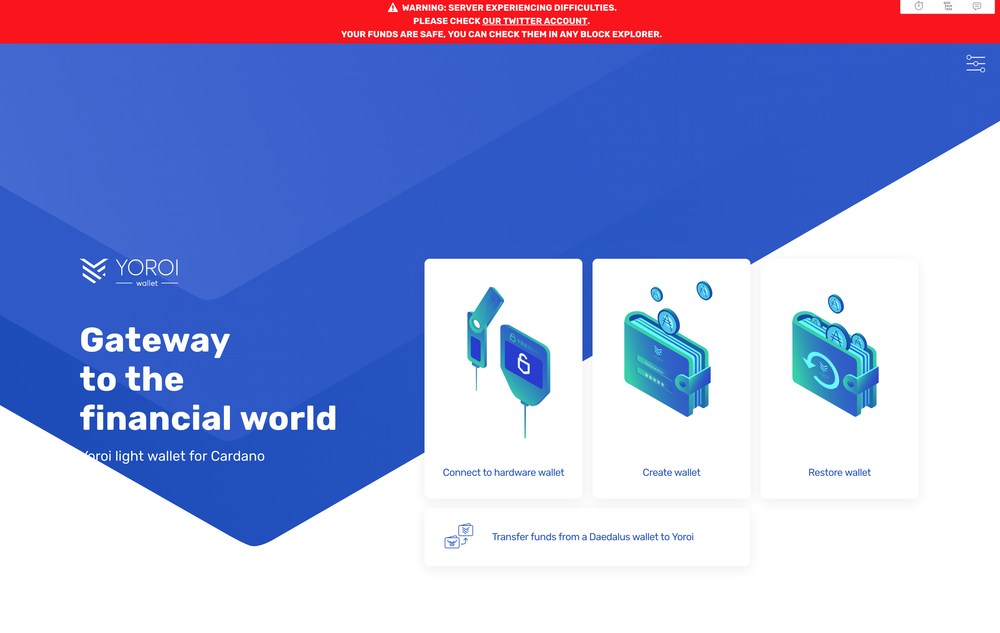
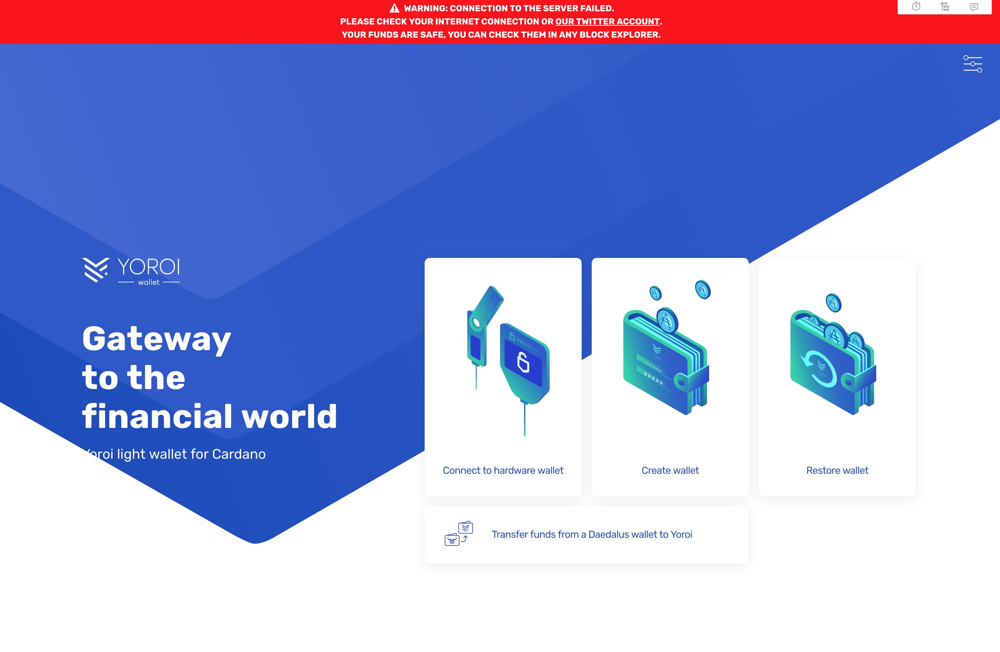

# Abstract

Describe a new endpoint to notify server issues to Yoroi-frontend, describe the front-end changes to handle and display this information.

# Motivation

Currently, Yoroi-frontend has no way to notify neither server issues nor connection issues. A new endpoint notifying the server status can be implemented in the back-end and the front-end can get this information periodically to display information if a problem is reported. Also, if the endpoint doesn't respond, the front-end can assume there is a connection issue.

Also, once Yoroi has the ability to notify server issues, the endpoint used by Yoroi to fetch the information can be used to create a public URL that reports the mentioned status, such as [AWS](https://status.aws.amazon.com/) and [Twitter](https://status.twitterstat.us).

# Proposal

## Backend

Adding a new endpoint in the backend named `api/status` is proposed. This endpoint has the method `GET` that returns an object with the form

```
{ isServerOk: true | false }
```

Where `isServerOk` is the last value of the column with the same name in the following table:

```
CREATE TABLE yoroi_metadata.api_statuses ( id      serial    NOT NULL PRIMARY KEY
                         , status  boolean      NOT NULL
                         , time    timestamp with time zone NULL
                         );
```

In this table, `id` is the index of the inserted status, `status` is a boolean that is `true` when the server reports no issue and `false` otherwise; and `time` is the time of the insertion of the mentioned status.

The element insertion will be performed manually into the database. This is to simplify the implementation due to time constraints and avoid the use of a protected `POST` method (adding this is out the scope of the present spec and could be added in a future enhancement).
In current deployments, the schema creation and table creation will be performed manually. This has to be performed before merging the front-end code and the back-end code. Once created, the table must be initializated with the value:

```
INSERT INTO yoroi_metadata.api_statuses (status, time)
VALUES (TRUE, now());
```

For future deployments, the scripts of the of the table creation must be updated (including initialization).

The use of custom messages or other flags in the mentioned JSON is out of the scope of the present spec. This is to avoid the overload of translating the message into all the supported messages and avoid spreading malicious messages in case of an attack (the front-end will have hardcoded messages that redirect to our official communication channel, Yoroi's Twitter).

## Frontend

A new store called `serverConnectionStore` will be added in the `AdaStoresMap`. This store contains a variable that triggers the rendering (or hiding) of the new banner, this variable is a enum `ServerStatusErrorType` with the following values:
* `'healthy'`: this value is returned when the server reports no issue.
* `'server'`: this value is returned when the server reports an issue.
* `'network'`: this value is returned when the connection with the server is not possible.

The `'healthy'` is then used to let the frontend know that the banner must stop being rendered. The other values are used to select which message will be displayed in the banner.

### GUI

The GUI component consists of an irremovable red banner that will be displayed on the top part of all the screens. This banner is rendered while the endpoint reports a problem or the connection is not possible and is similar in appearance to the one displayed in the nightly network.
When the endpoint report `false`, the message is:

```
WARNING: SERVER EXPERIENCING DIFFICULTIES.
PLEASE CHECK [OUR TWITTER ACCOUNT](https://twitter.com/yoroiwallet/).
YOUR FUNDS ARE SAFE, YOU CAN CHECK THEM IN ANY BLOCK EXPLORER.
```

For example:



And when the connection with the endpoint fails, the message is:

```
WARNING: CONNECTION TO THE SERVER FAILED.
PLEASE CHECK YOUR INTERNET CONNECTION OR [OUR TWITTER ACCOUNT](https://twitter.com/yoroiwallet/).
YOUR FUNDS ARE SAFE, YOU CAN CHECK THEM IN ANY BLOCK EXPLORER.
```



The behavior is that this new banner will overlap the nightly banner if both are present and it will be shown in all the screens of Yoroi.
