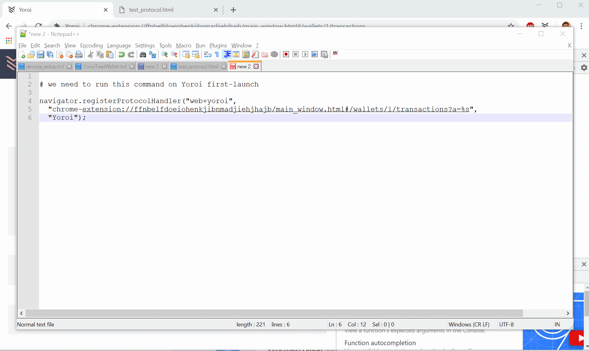
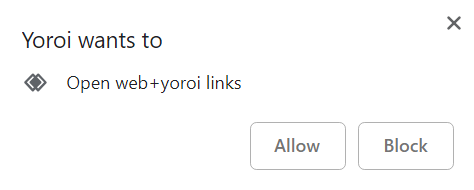

# Abstract

This proposal describes a basic URI scheme to handle ADA transfers, as well
as possible approaches for a multiplatform implementation.

# Motivation

Users who create community content often want donations as a financial incentive. However, no consumer wants to
- A) Open Daedalus as it takes too long to sync
- B) Copy paste the user address and decide how much to send

Yoroi is unique in that opening our wallet is near-instant and already runs in
your browser. We hope that adding a three-click donation system would greatly
encourage adoption of Ada payments. This URI scheme would enable users to easily
make payments by simply clicking links on webpages or scanning QR Codes.

# Proof of Concept



# Core Implementation

The core implementation should follow the [BIP-21](https://github.com/bitcoin/bips/blob/master/bip-0021.mediawiki) standard (with `bitcoin:` replaced with `web+cardano:`)

Rationale:
- Use `cardano:` over `ada:` as other projects that implement this standard tend
to take the project name over the currency name (this makes sense if we consider this protocol as a generic way for interacting with the blockchain through wallets -as opposed to a simple payment system)
- Many wallets support multiple currencies. Following the same standard will ensure higher adoption of our protocol.

Example:
```
<a href="web+cardano:Ae2tdPwUPEZ76BjmWDTS7poTekAvNqBjgfthF92pSLSDVpRVnLP7meaFhVd">Donate</a>
```
## Considerations

1. BIP-21 is limited to only features Bitcoin supports. A similar feature for Ethereum would, for example, also support gas as an extra parameter. BIP-21 is easily extensible but we have to take precaution to avoid different wallets having different implementations of these features as they become available on Cardano. To get an idea of some extra features that could be added, consider this (still under discussion) proposal for Ethereum: [EIP-681](https://eips.ethereum.org/EIPS/eip-681)

2. Depending on the protocol registration method (see next section), browsers generally enforce a `web+` or `ext+` (for extensions) prefix for non-whitelisted protocols (note: `bitcoin:` was whitelisted).

# Multiplatform Implementation

## Registering the Protocol in Web Browsers

There are two common approaches to register a custom protocol in modern web
browsers: `Navigator​.register​Protocol​Handler()` [(1)][1] and `protocol_handlers` [(2)][2]. The former currently works in Chrome and the latter
in Firefox. Some details on both methods are given next.

### Considerations

Using the `Navigator​.register​Protocol​Handler()` method:

1. A new protocol is registered by executing:

        navigator.registerProtocolHandler(
          "web+cardano",
          "chrome-extension://ffnbelfdoeiohenkjibnmadjiehjhajb/main_window.html#/?a=%s",
          "Yoroi");

  Note that this requires a specific URL format (ie. must contain `%s`).

2. This method has a same-domain security policy, so protocol handlers can only be added for the same domain the user is currently viewing.
In our case, this means we can only register this protocol from within the Yoroi extension.

3. Registering a new protocol prompts the user to accept:
  

4. This method is in general **only available within secure contexts (HTTPS)**.
As a consequence, registering a protocol from within an extension doesn't work
in some browsers, (see row "Secure context required" in [(1, section Browser compatibility)][1]). Currently **works in Chrome but not
in Firefox**.

Using the `protocol_handlers` method:

1. The protocol is registered inside the `manifest.json` file, eg.:
        "protocol_handlers": [
          {
            "protocol": "ext+cardano",
            "name": "Yoroi",
            "uriTemplate": "main_window.html#/wallets/1/transactions?a=%s"
          }
        ]
  Note: the prefix `ext+` is recommended for extensions, but not mandatory.

2. This method only seem to work using a relative `uriTemplate` as shown above. Using an absolute URL throws a security error (requires HTTPS).

3. It does not impose the same-domain security policy. This
means the protocol is simply pre-registered "from factory" and should be effectively activated after the first time the user clicks on a URI and gives the corresponding permissions.

4. This option is currently **only supported by Firefox** (see [(2, section Browser compatibility)][2])

### Suggested Implementation

1. As explained above, we will need to implement two different methods to register
  the protocol. The following approaches can be considered:
  - A) Chrome
    * Register protocol during first-boot.
    * We add an explanation of this feature and what the prompt will look
      like. Once the user presses a “understood button”, we register the
      protocol causing the browser prompt to appear.
  - B) Firefox
    * The protocol is pre-registered in the `manifest.json`.
      Users should simply grant (or deny) permission once clicking on a URI for
      the first time.

2. Since the extension ID is uniquely determined by the private key we use to upload our app to the Chrome store, we can safely assume it will not change and therefore we should just hard-code it. Alternatively, we may just use a relative
URL (eg. `main_window.html#/path/to/page`). The advantage of the latter approach
is that it is

3. The URI (which replaces the placeholder `%s`) should be passed as an argument to a special page in the Yoroi app and not the send page (see Future Proof section for more detail)

### Note

1. Since the user can choose “block” or remove the handler at any time from his browser settings, we cannot enforce this feature
2. Here is the list of browsers that support this feature: [registerProtocolHandler](https://developer.mozilla.org/en-US/docs/Web/API/Navigator/registerProtocolHandler#Browser_compatibility)

# Security Considerations

1. We cannot prompt the user to send the funds right away as they may not be fully aware of the URI they clicked or were redirected to. Instead, it may be better to simply pre-populate fields in a transaction.
2. We should be wary of people who disguise “donate” links as actually opening up a phishing website that LOOKS like Yoroi with the fields pre-filled.

## Registering the Protocol in Mobile Apps

TODO

# Future Proof Considerations

## Considerations

1. Once we pick a page in Yoroi to send users to, we cannot easily change it (since it will be baked into the protocol)
2. Before sending a transaction, the user may have to make extra choices (such as which wallet to send from if Yoroi eventually supports multiple wallets).These options should not all be listed on the “send” page

## Suggested Implementation
We should create a new page in Yoroi to handle these URI links that way we can prompt the user for additional decisions in the future before redirecting them to the appropriate page.

## Note
Users may have downloaded Yoroi and registered the protocol but have not created a wallet yet

[1]: https://developer.mozilla.org/en-US/docs/Web/API/Navigator/registerProtocolHandler

[1:browser-compatibility]: https://developer.mozilla.org/en-US/docs/Web/API/Navigator/registerProtocolHandler#Browser_compatibility

[2]: https://developer.mozilla.org/en-US/docs/Mozilla/Add-ons/WebExtensions/manifest.json/protocol_handlers
