# E2E Tests

This directory contains end-to-end tests for the Yoroi extension using Selenium WebDriver and Mocha.

## Table of Contents

- [Preparation Steps](#preparation-steps)
- [How to Run on CI](#how-to-run-on-ci)
- [How to Run Locally](#how-to-run-locally)
- [Project Structure](#project-structure)

## Preparation Steps

Before running the e2e tests, ensure you have completed the following setup:

### Prerequisites

1. **Node.js**: Ensure you have the correct Node.js version installed as specified in `.nvmrc` at the project root.

2. **Chrome Browser**: Chrome browser must be installed on your system. The tests use ChromeDriver which is included as a dependency.

3. **Install Dependencies**: Install all project dependencies:
   ```bash
   # From project root
   . install-all.sh
   
   # Or specifically for e2e-tests
   cd packages/e2e-tests
   npm install
   ```

4. **Build the Extension**: The extension must be built before running tests. From the project root:
   ```bash
   cd packages/yoroi-extension
   npm run test:build
   ```
   This will create `Yoroi-test.crx` in the `packages/yoroi-extension` directory, which is required by the e2e tests.

5. **Environment Variables** (for local testing): Some tests may require environment variables for test wallets. These are typically set as secrets in CI but may need to be configured locally:
   - `FIRST_SMOKE_TEST_WALLET`
   - `TEST_WALLET_MAINNET_1`
   - `SECOND_STATIC_TEST_WALLET`
   - `SECOND_SMOKE_TEST_WALLET`
   - `SECOND_SMOKE_TEST_WALLET_FF`
   - `CHROME_PATH` (optional, defaults to system Chrome)

6. **Hardware Wallet Emulators** (for hardware wallet tests):
   - **Trezor**: Requires Docker to run the Trezor emulator. Please check detailed info in the [documentation](https://emurgo.atlassian.net/wiki/x/LoDHKw).
   - **Ledger**: Requires Docker to run Speculos emulator. Please check detailed info in the [documentation](https://emurgo.atlassian.net/wiki/x/MACdZQ).

## How to Run on CI

The e2e tests run automatically on GitHub Actions when:

- A pull request is approved
- A pull request review is submitted with specific triggers

### Triggering Tests

Tests can be triggered by adding specific comments in PR reviews:

- `/check` - Runs all extension test suites
- `/ext-general` - Runs extension tests (which not includes tests for dapp, trezor and ledger)
- `/dapp-general` - Runs dApp tests
- `/trezor` - Runs Trezor hardware wallet tests
- `/ledger` - Runs Ledger hardware wallet tests

### CI Workflow

The CI workflow consists of the following jobs:

1. **Build-Extension**: Builds the extension for testing
   - Installs dependencies
   - Builds the test version of the extension (`npm run test:build`)
   - Archives the built extension as an artifact

2. **Extension**: Runs extension test suites (runs in parallel for each suite)
   - Test suites: `cashback`, `general`, `governance`, `nft`, `portfolio`, `receive`, `send`, `settings`, `transactions`
   - Uses headless Chrome

3. **DApp-General**: Runs dApp connection and interaction tests
   - Uses xvfb for virtual display
   - Tests dApp wallet connections

4. **Trezor**: Runs Trezor hardware wallet tests
   - Starts Trezor user environment Docker container
   - Tests Trezor wallet connection and operations

5. **Ledger**: Runs Ledger hardware wallet tests
   - Uses Speculos Docker emulator
   - Tests Ledger wallet connection and operations

### Test Artifacts

On test failure, the following artifacts are archived:
- `mochawesome-report/` - HTML test reports
- `testRunsData/` - Screenshots and logs from test runs

## How to Run Locally

### Running Extension Tests

Navigate to the e2e-tests directory:
```bash
cd packages/e2e-tests
```

#### Run All Extension Tests

```bash
npm run test:ext:all
```

#### Run Specific Test Suites

```bash
# Cashback tests
npm run test:ext:cashback

# General tests
npm run test:ext:general

# Governance tests
npm run test:ext:governance

# NFT tests
npm run test:ext:nft

# Portfolio tests
npm run test:ext:portfolio

# Receive tests
npm run test:ext:receive

# Send tests
npm run test:ext:send

# Settings tests
npm run test:ext:settings

# Transactions tests
npm run test:ext:transactions
```

#### Run Smoke Tests

Tests with the tag `_smoke_` will be run

```bash
npm run test:ext:smoke
```

#### Run a Single Test

```bash
npm run test:ext:one "YOUR_TEST_NAME_HERE"

# Example
npm run test:ext:one "Creating wallet _smoke_"
```

### Running Hardware Wallet Tests

#### Trezor Tests
```bash
# Start Trezor emulator (requires Docker)
docker run -d \
  -p 9001:9001 \
  -p 9002:9002 \
  -p 21326:21326 \
  -p 127.0.0.1:21325:21326 \
  ghcr.io/trezor/trezor-user-env:4c194889610c3f21f1da3799e7ddb82004fd4e91

# Run Trezor tests
npm run test:trezor

# Run a single Trezor test
npm run test:trezor:one "YOUR_TEST_NAME_HERE"
```

#### Ledger Tests
```bash
# Pull and run Speculos emulator (requires Docker)
docker pull ghcr.io/ledgerhq/speculos:0.25.9

# Run Ledger tests
npm run test:ledger

# Run a single Ledger test
npm run test:ledger:one "YOUR_TEST_NAME_HERE"
```

### Running dApp Tests
```bash
npm run test:dapp

# Run a single dApp test
npm run test:dapp:one "YOUR_TEST_NAME_HERE"
```

### Running Tests in Non-Headless Mode

By default, tests run in headless mode. To run with visible browser:

```bash
# Remove HEADLESS=true from the command
npm run test:ext:base
```

But tests for DApp are running in the normal mode with UI. It is the limitation of these tests.

### Test Reports

Test reports are generated using `mochawesome` and can be found in:
- `mochawesome-report/` - HTML reports
- `testRunsData/` - Screenshots and logs

## Project Structure

The e2e-tests project follows the Page Object Model (POM) pattern for better maintainability and reusability.

### Directory Structure

```
packages/e2e-tests/
├── helpers/              # Helper functions and utilities
│   ├── constants.js      # Test constants and configuration
│   ├── customChecks.js   # Custom assertion helpers
│   ├── ledgerEmulatorController.js
│   ├── trezorEmulatorController.js
│   ├── wallet-dbSnapshots/  # Pre-configured wallet snapshots
│   └── ...
├── pages/                # Page Object classes
│   ├── basepage.js       # Base page object (root)
│   ├── walletCommonBase.page.js
│   ├── initialSteps.page.js
│   ├── trezorConnect.page.js
│   ├── ledgerConnect.page.js
│   └── wallet/           # Wallet-related page objects
│       ├── walletTab/
│       ├── portfolio/
│       ├── settingsTab/
│       └── ...
├── test/                 # Test files
│   ├── extension/        # Extension tests
│   ├── ledger/           # Ledger tests
│   ├── trezor/           # Trezor tests
│   └── dapp/             # dApp tests
└── utils/                # Utility functions
    ├── hooks.mjs         # Mocha hooks
    ├── driverBootstrap.js
    └── ...
```

### Page Objects Dependencies

The following diagram shows the inheritance and dependency structure of page objects:

```mermaid
graph TD
    BasePage[BasePage]
    
    %% Base connections
    BasePage --> WalletCommonBase[WalletCommonBase]
    BasePage --> InitialStepsPage[InitialStepsPage]
    BasePage --> TrezorConnect[TrezorConnect]
    BasePage --> LedgerConnect[LedgerConnect]
    
    %% WalletCommonBase children
    WalletCommonBase --> WalletTab[WalletTab]
    WalletCommonBase --> PortfolioTab[PortfolioTab]
    WalletCommonBase --> NftGalleryTab[NftGalleryTab]
    WalletCommonBase --> ConnectorTab[ConnectorTab]
    WalletCommonBase --> AddNewWallet[AddNewWallet]
    WalletCommonBase --> Governance[Governance]
    WalletCommonBase --> SettingsTab[SettingsTab]
    WalletCommonBase --> StakingTab[StakingTab]
    
    %% PortfolioTab children
    PortfolioTab --> PortfolioTokenDetails[PortfolioTokenDetails]
    
    %% NftGalleryTab children
    NftGalleryTab --> NftDetails[NftDetails]
    
    %% WalletTab children
    WalletTab --> TransactionsSubTab[TransactionsSubTab]
    WalletTab --> ReceiveSubTab[ReceiveSubTab]
    WalletTab --> SendSubTab[SendSubTab]
    
    %% SettingsTab children
    SettingsTab --> GeneralSubTab[GeneralSubTab]
    SettingsTab --> BlockchainSubTab[BlockchainSubTab]
    SettingsTab --> WalletSubTab[WalletSubTab]
    SettingsTab --> SupportSubTab[SupportSubTab]
    SettingsTab --> TermOfServiceAgreementSubTab[TermOfServiceAgreementSubTab]
    
    %% Modals (connected from BasePage)
    BasePage -.->|modals| BuySell[BuySell]
    BasePage -.->|modals| DisplayURIModal[DisplayURIModal]
    BasePage -.->|modals| NetworksInfoModal[NetworksInfoModal]
    BasePage -.->|modals| SwitchNetworkModal[SwitchNetworkModal]
    BasePage -.->|modals| VerifyAddressModal[VerifyAddressModal]
    BasePage -.->|modals| GenerateURIModal[GenerateURIModal]
    BasePage -.->|modals| ExportTransactionsModal[ExportTransactionsModal]
    BasePage -.->|modals| MemoWarningModal[MemoWarningModal]
    BasePage -.->|modals| AddMemoDialog[AddMemoDialog]
    BasePage -.->|modals| EditMemoDialog[EditMemoDialog]
    BasePage -.->|modals| DeleteMemoModal[DeleteMemoModal]
    
    %% Styling
    classDef basePage fill:#e1f5ff,stroke:#01579b,stroke-width:3px,color:#000000
    classDef walletBase fill:#fff3e0,stroke:#e65100,stroke-width:2px,color:#000000
    classDef tab fill:#f3e5f5,stroke:#4a148c,stroke-width:2px,color:#000000
    classDef subTab fill:#e8f5e9,stroke:#1b5e20,stroke-width:1px,color:#000000
    classDef modal fill:#fce4ec,stroke:#880e4f,stroke-width:1px,stroke-dasharray: 5 5,color:#000000
    
    class BasePage basePage
    class WalletCommonBase walletBase
    class WalletTab,PortfolioTab,NftGalleryTab,ConnectorTab,AddNewWallet,Governance,SettingsTab,StakingTab tab
    class TransactionsSubTab,ReceiveSubTab,SendSubTab,GeneralSubTab,BlockchainSubTab,WalletSubTab,SupportSubTab,TermOfServiceAgreementSubTab,PortfolioTokenDetails,NftDetails subTab
    class BuySell,DisplayURIModal,NetworksInfoModal,SwitchNetworkModal,VerifyAddressModal,GenerateURIModal,ExportTransactionsModal,MemoWarningModal,AddMemoDialog,EditMemoDialog,DeleteMemoModal modal
```



### Key Components

- **BasePage**: The root page object that all other page objects inherit from. Contains common functionality and modal access.

- **WalletCommonBase**: Base class for all wallet-related page objects. Inherits from BasePage.

- **Tab Pages**: Represent different tabs in the wallet interface (WalletTab, PortfolioTab, SettingsTab, etc.)

- **SubTab Pages**: Represent sub-sections within tabs (e.g., TransactionsSubTab within WalletTab)

- **Modal Pages**: Represent various modals and dialogs that can appear throughout the application. These are typically accessed from BasePage.

- **Connection Pages**: Handle wallet connection flows (InitialStepsPage, TrezorConnect, LedgerConnect)

### Test Organization

Tests are organized by feature area:
- `test/extension/` - Main extension functionality tests
- `test/ledger/` - Ledger hardware wallet tests
- `test/trezor/` - Trezor hardware wallet tests
- `test/dapp/` - dApp connection and interaction tests

Each test suite can be run independently using the npm scripts defined in `package.json`.
